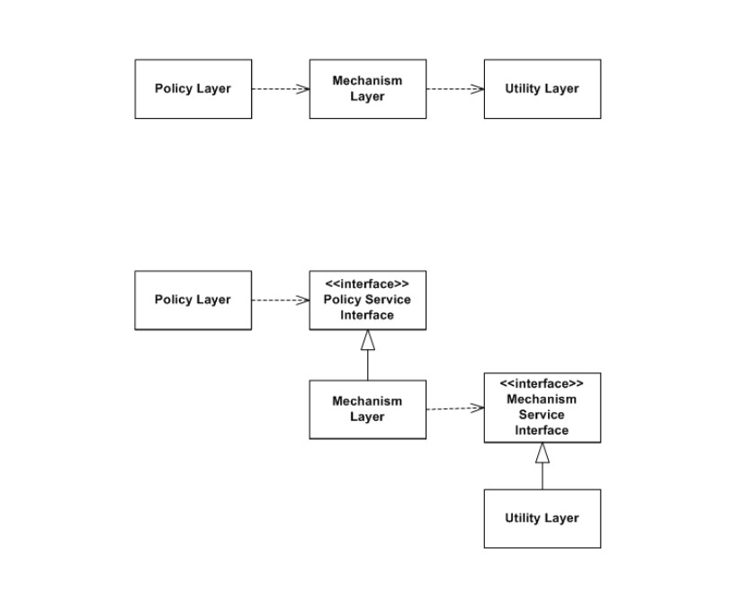

# Chapter 2

Agile software engineering: deliver functionality quickly

## Agile Method Principles:
- **Customer involvement** - help reach new functionalities and review the iterations
- **Embrace change** - expect the requirements to change
- **Incremental delivery** - software is developed in increments, with the customer helping
- **Maintain Simplicity**
- **People, not Process** - The developers should work without any processes

## Agile Development Techniques

 - **Test driven development** - Tests are written first to have an idea on what the feature should be
 - **Continuous Integration** - When a task is done, it should be integrated to the whole system and a new version should be launched.
 - **Refactoring** - Improve structure, readibility, efficiency or safety of the program

 ## Scrum - Agile Method

 - **Product Owner** - Ensures dev team is focused on building the product
 - **ScrumMaster** - Guides the team on using the Scrum method. Like a coach of the team
 - **Scrum** - Daily meeting with the dev team that reviews progress and decides on what should be the work to be done for the day
 - **Sprint** - Development Iteration (2-4 weeks)
 - **Velocity** - Estimative of how much the dev team can do of the product backlog in a single sprint
 - **Product Backlog** - Todo List that the team must tackle
 (The product backlog may include product features to be implemented,user requests, essential development activities, and desirable engineering improvements.)

 # Chapter 3

 ## Development Testing

  - **Unit tests** - Individual units are tested independently (Function, Method,Class)\
        May be:\
        • Individual functions or methods within an object\
        • Object classes with several attributes and methods\
        • Composite components with defined interfaces used to access their functionality.

  - **Component tests** - Tests groups of related units or componentes together

  - **System tests** - Tests the behaviour of the entire system

## Testing Strategies

 - **White box implementation** - Tests the internal structure (algorithms, code, internal paths) or working of a system where tests were made based on the internal logic of the system and source code.\
 Testers have access to the whole project and make use of techniques such as **branch,path,condition** and **statement coverage**.

 - **Black box testing** - Tests the functionality of a system without knowing how it works or its arquiteture.\ 
 Tests are based on external specifications,requirements documents, user stories and cases to produce tests. Testers make use of techiniques such **equivalence partitioning**, **boundary values**.

## Partition Testing

Given an input space, partition testing selects groups of inputs that have common characteristics and should be processed the same way

A: 90-100\
B: 80-89\
C: 70-79\
D: 60-69\
F: Below 60

Equivalence Class 1 (A): Scores from 90 to 100.\
Equivalence Class 2 (B): Scores from 80 to 89.\
Equivalence Class 3 (C): Scores from 70 to 79.\
Equivalence Class 4 (D): Scores from 60 to 69.\
Equivalence Class 5 (F): Scores below 60.

## Guideline-based testing

Use testing guidelines to choose test cases based on previous experience of errors that programmers usually make.

### General guidelines:
• Choose inputs that force the system to
generate all error messages\
• Design inputs that cause input buffers
to overflow\
• Repeat the same input or series of
inputs numerous times\
• Force invalid outputs to be generated\
• Force computation results to be too
large or too small.

## Boundary Value analysis

Given the input classes, to minimize the amount of tests to do, you should choose to test only the boundaries of the whole domain:

Minimum Boundary Values:

Test Case 1: Input score = 90 (minimum value for grade A)\
Test Case 2: Input score = 80 (minimum value for grade B)\
Test Case 3: Input score = 70 (minimum value for grade C)\
Test Case 4: Input score = 60 (minimum value for grade D)\
Test Case 5: Input score = 0 (lowest possible score, below grade F)\

Maximum Boundary Values:

Test Case 6: Input score = 100 (maximum value for grade A)\
Test Case 7: Input score = 89 (maximum value for grade B)\
Test Case 8: Input score = 79 (maximum value for grade C)\
Test Case 9: Input score = 69 (maximum value for grade D)\
Test Case 10: Input score = 59 (highest possible score, just below grade F)\

Outside input boundary values:\
Test Case 11: Input score = -1
Test Case 12: Input score = 101

 ## Test Double
 
 Any kind of pretend object used in place of a real object to simulate the behaviour for testing purposes (Mock)

# Chapter 4

## Code Coverage

Measure the amount of code that was executed during a test and can be divided into the following:

 - **Statement Coverage** - each statement is executed at least once
 - **Branch Coverage** - each boolean condition is evaluated to true and false as a whole.\
Example: (a || b) is evaluated to T and F. But a and b dont need to be evaluated individually.
 - **Condition Coverage** - each boolean sub-expression is evaluated to T and F
 Example: (a || b). Both a and b are evaluated to T and F
 - **Path Coverage** - every independent path is executed. An independent path is one that traverses at least one new edge in the flow graph
 aka **Structure Basis Testing**
\
\
\
 

## Object Testing

While unit testing, tests methods in isolation, object testing tests the **sequences of methods**

**Modal Class** - The internal state impacts on the possible sequences of method invocations.\
Examples: Account,Customer,Product,Order.

**Non-Modal Classes** - Don't directly represent entities or concepts in the system domain, instead they serve as helpers.\
Examples: Utility Classes (MathUtils,StringUtils), Helper Classes (FileHelper,ConversionHelper)

Given a student, we could object test it by evaluating its state transitions:

**Evaluate Success**
 - Application -> Not Admitted
 - Application -> Admitted -> Registered -> Quit
 \
 \
 .

**Evaluate Errors**
 - Application -> Not admitted -> Registered

 ## Component Testing 

 After testing methods in isolation and interactions between them, **Component Testing** tests interactions between interfaces of different components and classes.

 **Goal:** Detect faults due to interface errors or invalid assumptions about interfaces.

 ### Component Testing approaches

  - **Big Bang integration**: All components together. Used when there are dependencies between units.
  
  - **Incrementally** - Bottom-up or Top-down. When its difficult to identify the fault.

  

  \
\
      **...**\
\
  

 - **Sandwich Integration**: test multiple groups of classes.

 

 ## Test Pyramid 

 **UI tests - E2E tests** - 5%\
 **Integration tests - Service tests** - 15%\
 **Unit tests** - 80% 

 # Chapter 5

 ## Refactoring
 
 Parece-me tudo common knowledge mas rever se tiver tempo

 ## Code Reuse

 - **Library Reuse** - Using other people code to perform some activity on your code. You keep control on the output of the library code.

      

 - **Framework Reuse (JUnit, Spring Boot, Vue)** - We're writing code for an already built system, which means that in theory we're not writing new code but using a skeleton to generate functionalities without really understanding the inside of it.\
 It follows the **Hollywood Principle** - "Don't call us, we'll call you". (Meaning that the framework we're using eventually invokes our code and not the other way around.)

      
      

 - **Code generators (JPA)** - This will be high level sentences that we write on our code that will write and run code for us. One example is on our project when we use @GetMapping() ... we're associating a function to be executed when someone sends a get request to a certain link. This decorator is generating code under the hood that does this routing automatically.
 More of these could be for example @Entity, @Transactional etc..\

      There are different types:
      - **Aspect oriented development** - Your code will be in the middle of the generated code, just like a wrapper around your code. We can take the example of Transactional that takes your code and starts a transaction in db which could be cancelled in case your code throws an exception.
      - **Model driven enginnering** - Essentially what low code platforms use in order to encapsulate the complexity of code for non programmers people. These will then translate the instructions of the user into real code.

- **Product-Lines** - Didn't understand much 
- **Services (Google docs)** - Not only do you reuse the code but also share the service where the code is.

# Chapter 7

## Cohesion and Coupling

Cohesion is symmetric
Coupling is assymetric

**High Cohesion** - Each module have a single responsability meaning that if you wanted to make a change in a high cohesion module, all the context for the responsability is located there. By reading the module you wouldn't need any other context beside what you have there.

**Low Coupling** - If you have a module with low coupling, it means that if you wanted to make a change there, you wouldn't need to change the modules that interact with this one. Coupling evaluates 2 modules which means that if you have a module A that by making a change do not propagate to B (dont need to make a change on B), but if you change B it propagates to A, it means that coupling is asymmetric.

## Design Patterns

**Command** - Encapsulates user commands into a object which allows us to save this requests in a structure like a queue, prioqueue, etc..\
In this design pattern, the **invoker** has **low coupling** with both the **command** and **concrete command**. **Concrete command** also has a **high cohesion** since all the context is located in the same place.

**Composite** - Describes a group of objects that are treated the same way. On the following example we can see that we have an interface **(Box)** that is the only element the client interacts with. The box then contains different type of elements (CompositeBox and Products) that even though are different, all of them implement the abstract class method to do something.\
This said, we can say that Client and Box have **Low coupling** and the LEaf component has **high cohesion** since all the logic is described inside of it.

**State** - Used when the same object could behave differently meaning it would imply different if else classes. By encapsulating these different types of objects, all the logic would go solely to the class that extends the main one. Given this, the context wouldn't need to understand the different types of classes there is since all of them will implement the same operations given by overriding the main class. This said, we can conclude that the **context** and the **super class** would have **low coupling** since you can create new states without affecting the contxt and each the **states** have **high cohesion** since all the logic is dependant from the state.

## Interfaces

An interface is one that provides low coupling.

 - **No encapsulation** - Exposes all the attributes

 - **Shared data model** - Have complex entities (with their own structure on their own) has parameters which means this type of interface would be some type of contract between the current module and the one that is using it. Everytime you make a change in the current model you will have to propagate changes since its a shared data model

 - **No shared data model** - Only contains simple data types such as ints, floats, chars, etc.. This for itself doesnt grant low coupling since if you need to change the number of simple data type to use, it could affect other modules

 - **WSLD/REST** - The interface is independent of the programming language which means that its hiding the implementation of a particular programming language. An example of this could be an API

 - **XML Schema** - Contains the meta-model. Allows us to use not a specific syntax since the schema will analyze it and convert it however, it needs to follow the schema rules in order to work

## Abstractions

Abstractions fully depend on the context which means there's no such thing as a correct or wrong abstraction. (this is an argument to define bottom-up abstractions.)\
A good interface fully depend on good abstractions and good abstraction are not easy to find, it takes a lot of time.

## Design Processes

- **Bottom up** - Abstractions are constantly refactored since its always evolving depending on what are its functionalities.

- **Top down** - From the problem space to the solution space. This means that firstly we need to define the requirements and then proceed to get the best design structure.

## Design Principles

 - #### Open close principle 
      Modules should be open for extension but closed for modifications.\
      **Low coupling** from clients and **high hierarchical cohesion**

      

 - #### Dependency Inversion Principle
      High level modules shoulnd't depend on Low level modules. Both should depend on abstractions.\
      Abstractions should not depend on details. Details should depend on abstractions.\
      **Low coupling** by depending on abstractions

      

 - #### Interface Segregation Principle
      Clients should not be forced to depend on interfaces they don't use, therefore there are multiple interfaces and the clients only implement the ones they need.\
      **Low coupling** by depending on minimal resposibilities.

      #### Bad design example:

            Fat interface
                  interface ElectronicDevice {
                  void turnOn();
                  void turnOff();
                  void print(String document);
                  void scan(String document);
                  void fax(String document);
            }

      #### Good design example:
            Individual interfaces
            interface Switchable {
                  void turnOn();
                  void turnOff();
            }

            interface Printer {
                  void print(String document);
            }

            interface Scanner {
                  void scan(String document);
            }

            interface Fax {
                  void fax(String document);
            }

            class BasicPrinter implements Switchable, Printer {
                  //Implement turnOn, turnOff, and print methods
            }

            class AllInOnePrinter implements Switchable, Printer, Scanner, Fax {
                  //Implement turnOn, turnOff, print, scan, and fax methods
            }

 - #### Single Responsability Principle
      A module should have only one reason to change\
      Grants **high cohesion**

      #### Bad design example:

            class Employee {
                  String name;
                  String address;
                  double salary;
            
                  void calculateSalary() {
                        // Calculation logic
                  }
                  
                  void saveToDatabase() {
                        // Saving logic
                  }
                  
                  void generateReport() {
                        // Report generation logic
                  }
            }

      #### Good design example:

            class EmployeeData {
                  String name;
                  String address;
                  double salary;
                  // Getters and setters
            }

            class SalaryCalculator {
                  double calculateSalary(EmployeeData employee) {
                        // Calculation logic
                  }
            }

            class DatabaseManager {
                  void saveToDatabase(EmployeeData employee) {
                        // Saving logic
                  }
            }

            class ReportGenerator {
                  void generateReport(EmployeeData employee) {
                        // Report generation logic
                  }
            }

 - #### Liskov's Substitution Principle
      Subtypes should be substituble for their superclasses without affecting the system.
      **Low coupling** because the extensions preserve the abstraction

      

      

# Chapter 8

## Software Architeture

### Architetural stakeholders
 - Client
 - User
 - Dev Team
 - Business Team

 ### Stakeholders needs
 - Security
 - Time to Market
 - Performance
 - Availability
These are all non functional requirements.

Software architeture is where are defined the tradeoffs among the stakeholders needs.

## Architetural Patterns

 - #### Model-view-controller
      Separates presentation, iteraction from the system data.\
      **Model component** - Manages sytem data and operations with it\
      **View component** - How the data is shown to the user\
      **Controller component** - Manages user interaction and passes them into the view and model component (like a middleman)

      
      **Advantages**\
      Allow data to change idependently of its presentation.\
      Data presentation of the same in different ways.

      **Disavantages**\
      Can envolve additional code and complexity when the data model and interactions are simple.

      **Usage**\
      Different ways of interacting and viewing data.\
      Future requirements for interaction and presentation are uknown.

      ### Example: Web App

      

 - ### Layered 
      Organizes the system into layers that are responsible for the associated functionality.\
      A layer provides service to the layer directly above it so the lowest level **core services**.

      **Advantages**\
      Allow replacement of entire layers as long as the interface is maintained.\
      Redudant facilities (auth) can be provided for each layer to increase the dependability of the system (confiabilidade)

      **Disavantages**\
      Providing clear separation between layers is usually difficult.\
      High-level layers could need to interact with lower layers that the one below it.\
      Performance could be a problem because its interpretated by every single lane instead of having a place that does all the processing.

      **Usage**\
      When building new facilities on top of a system.\
      When the development is spread across different team (a team for each layer)\
      When multi layer security is needed

 - ### Repository
      All data is managed by a central repository that is accessible by all components.\
      Components only interact with the repository.

      **Advantages**\
      Components are independent of each other.\
      Changes in a component can be propagated to all of them.\
      Data from different components can be managed consistently since its all on the repository.\

      **Disavantages**\
      Problems in the repository affect all the system.\
      Distributing the repository across different computers can be hard.\

      **Usage**\
      When you have a system that generates large amounts of data that needs to be saved long term.

      ### Example - Bank System.

 - ### Client-server
      The functionality of the system is organized into services, which each service is delivered in a different service.

      **Advantages**\
      Servers can be distributed accross a network\
      A general functionality can be accessed by all users and don't need to be implemented by all services.\

      **Disavantages**\
      Perforamnce is unpredictable because it depends on the network and the system.\
      Each service is a point of failure.

      **Usage**\
      When data in a database needs to be accessed in different and far locations.

      ### Example - DVD shop
      

 - ### Pipe and Filter
      The processing of data is organized so that there are different filter components that handle on type of data. The data flows from a component to another for processing.\

      **Advantages**\
      Easy to understand.\
      Adding more data processing is straightforward.\
      Could be sequential or concurrent system.\

      **Disavantages**\
      The format of data has to be agreed between.
      Each transformation has to parse and unparse the data to the agreed format.

      **Usage**\
      Used in data processing apps where inputs are processed in separate stages.

      ### Example: Processing invoices

      

## Application Architeture

 - **Transaction Processing Systems** - Uses a transaction manager to access the database. An example of this is an **ATM system**.

 - **Information Systems** - Example:
 
      

 - **Language Processing Systems** - Example:

      

## Requirements engineering

 - **Functional requirements** - Describe the behaviour of the system.

 - **Non-functional requiremnents** - Describe the constraints of the system.

 - **Non-measurable requirement** - Not specific. Example: "The program has to show the patient data **quickly** in the monitor". Quickly is not specific.

 ### Lehmans Law
This law summarizes that the continuous evolution of a system is necessary to keep it useful for its users since systems are up to changes at any given time.

- **Continuous Changes**: Software systems must be continuously modified to maintain their relevance and usefulness.

 - **Increasing Changes**: Over time, the complexity of software systems tends to increase as new requirements are added and corrections are made.

 - **Conservative Changes**: Changes in a software system should be made conservatively to avoid the introduction of new errors or issues.

 - **Self-regulating Changes**: As a software system evolves, it should be able to self-regulate to adapt to changes in requirements and the environment.

### Different types of systems (S, P and E Systems)

 - **S-System (Social System)**: The S-System represents the social or human aspects of a system. It includes people, their roles, interactions, values, culture, and organizational structures within a given context. The S-System focuses on the social dynamics, behaviors, and relationships among individuals or groups within an organization.

 - **P-System (Physical System)**: The P-System refers to the physical or technical components of a system. It encompasses tangible elements such as tools, technology, equipment, infrastructure, and resources utilized within an organization. The P-System deals with the hardware, software, and other material resources that support the functioning of the system.

 - **E-System (Environmental System)**: The E-System represents the broader environment in which the system operates. It includes external factors, influences, and conditions that impact the system, such as economic, political, legal, ecological, and cultural aspects. The E-System acknowledges that organizations exist within a larger context and are influenced by various environmental factors beyond their immediate control.

# Chapter 10

## Enterprise Application 
 - **Persistent data**
 - **Large amount of data**
 - **Concurrent access**
 - **Large number of user interfaces**
 - **Application integration**
 - **Complex domain logic**

 ### An enterprise app is divided into the following layers:
 

 ## Domain Logic 

 - **Transaction Script** - Each use case is implemented in a single script that contain all the logic necessary to complete a specific task.\
 It has direct access to the DB.\
      **Disavantages**:\
       - Hard to reuse\
       - Code duplication\
       - Depends on the strongly on the database structure

 - **Domain Model** - Makes uses of the entities and separates the operations.\
      Each object have part of the domain logic.\
      **Advantages**:\
       - More stable\
       - More reusable\
      **Disavantages**\
       - One method != One transaction

## Service layer ??

## Data Access Layer Patterns

 - **Table Data Gateway**\
      An object that serves as a Gateway to a whole database table, meaning that is a class that interacts with the specific table in the db with methods.\
      All the SQL code is located inside the class, but does not provide OO interface.

      

 - **Row Data Gateway**\
      An object that acts as gateway to a single record in data source.\
      There is one instance for each row of the table.\
      All the SQL code for a table is in its own class.\
      Provides an OO interface but does not have domain logic.

      

 - **Active Record**\
      An object that wraps a row in a database, table or view.\
      Encapsulates database access.\
      Domain logic on that data.\
      SQL code and domain logic in the same place.\
      Provides a OO interface.

      

 - **Data Mapper**\
      Layer of mappers that moves data between objects and databases without mixing them.\
      Keeps the data and domain logic together.\
      Separates SQL code from domain logic.\
      Provides OO interface.

      

## Object-relational behavioral patterns
 Between the Domain logic and Data access layer, there needs to be a system thats in charge of managing persistent entitites and thats what this is.

 - **Unit of Work**\
 Maintains a list of objects affected by a transaction and coordinates the changes and the concurrency behind this proccess.\
 Keeps track of:
      - New objects
      - Deleted objects
      - Updated Objects (Dirty)
      - Read Objects (Clean)

      As the app interacts with domain objects, the Unit Of Work registers whats been added,deleted,read and updated. After this the UoW starts a transaction and goes through a list of tracked changes and **atomically** applies changes to the DB.
      To manage concurrency, unit of works can use one of the following:
      - **Optimistic Offline Locking**\
      Multiple users can read and modify data without aquiring locks upfront.\
      When a user wishes to update data, they first read the curr state of that data.\
      If no other user updated that data, the changes are applied otherwise the system prompts the user to solve the conflict.\
      **This locking type relies on the assumption that conflicts are very rare**

      - **Pessimistic Offline Locking**
      The system acquires locks preemptively before allowing users to read or modify them. (Normal locks that we use)
      **Relies on the assumption that conflicts are going to happen**

      

  - **Identity Map**\
  Ensure that each object gets loaded only once by keeping loaded objects in a map.\
  Loading the same object to memory can trigger consistency problems therefore it is needed to have a unique key for all objects.

      

 - **Lazy Load**\
 An object doesn't contain all the data you need but know how to get it.\
 Once an object is loaded from the database or created in memory, its starts off by loading only its attributes. (**Lazy initialization**)
 Then whenever is needed to get the relationships of this object the lazy loading mechanism is triggered and initializes a query to get the info needed.\
 **Virtual Proxy** ?

 - **Value Holder** - wraps the real object but has type problems

 - **Ghost** - Is a real object in a partial state but it only loads the identity.

 # Chapter 11

 ## Web Presentation Patterns

  - **Model View Controller**\
  Divides the presentation into 3 roles that interact with each other.

  

  - **Template View**\
      Renders information into HTML by adding custom elements onto it.\
      Its difficult to read and maintain if it turns too programatic so its usually not a good option for large projects.\
      We can take flask as an example that let us use custom python in the frontend.\
      Can be in the form of:
      - Custom code inside html
      - Logic inside the helper (adding custom and dynamic html in the helper functions)
      - Custom HTML tags

 - **Front Controller**\
      Controller that handles all requests for a website.\
      The biggest advantage is that it doesn't duplicate code since it uses decorators for common behaviour code and subclasses to define the specific code of a feature.\
      This also simplifies the configuration of a webserver since its all contained in the handler instead of in different page controllers.

      

## Distribution Patterns

 - **Remote Facade**\
      Provides a coarse-grained facade (broad object) on fine-grained objects (specific object) to improve efficiency.
      Since this pattern provides a coarse-grained interface, it means that is encapsulating or hiding the logic behind the system. By being a high level function that does multiple little things at once, will help minimize the amount of remote calls (since we'll only need one instead of n multiple little calls) which leads to a better efficiency over the network (since calls to the remote service are interprocess, its way more expensive so we minimize it to one call).

      

 - **Data Transfer Object**\
      Object that carries data between processes in order to reduce the number of method calls.\
      Instead the webservice calling the assembler and returning the result, the assembler returns an object with all the information needed for the frontend, without compromissing backend functionalities.\
      It aggregates data from several objects like the pics show and contain no logic.
      Since they need to be transfered inter processes, they need to be serialized in order to be transferred over a network.
      Because DTO's need to be serialized, they need getters and setters for all attributes and an empty constructor.

      

## Object-Relational Structural Patterns
Patterns to address mapping OOP to Database schemas.

 - **Indentity Field**\
 Saves a DB id field in an object to maintain identity of a object and its row in a DB table.

 - **Foreign Key Mapping**\
 Saves a object association into a FK reference between tables

      

 - **Association Table Mapping** 
 Saves a association table with FK to the tables that are associated.\
 Queries are done in 2 steps

      

 - **Single Table inheritance**
 Creates only one DB table based on the super and subclasses relationships of objects.\
 Groups the different subclasses of a main class.

      

 - **Class Table Inheritance**
 Creates a DB table for each every class in the hierarchy.\

      

 - **Concrete Table Inheritance**
 Creates a DB table for each subclass that is concrete (doesn't include non-specific/abstract classses)
 
      
